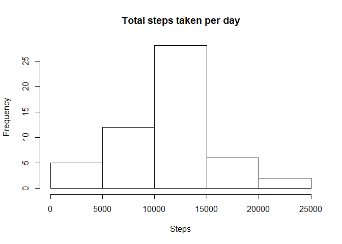
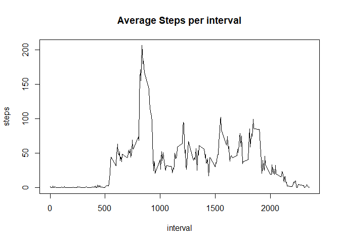
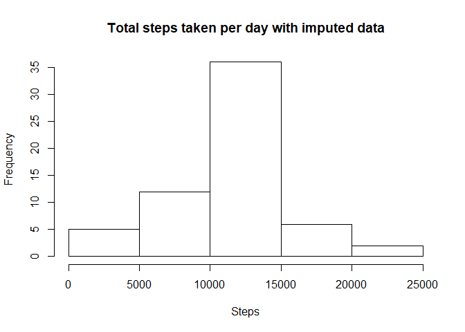

## Introduction
It is now possible to collect a large amount of data about personal movement using activity monitoring devices such as a Fitbit, Nike Fuelband, or Jawbone Up. These type of devices are part of the ¡°quantified self¡± movement ¨C a group of enthusiasts who take measurements about themselves regularly to improve their health, to find patterns in their behavior, or because they are tech geeks. But these data remain under-utilized both because the raw data are hard to obtain and there is a lack of statistical methods and software for processing and interpreting the data.

This assignment makes use of data from a personal activity monitoring device. This device collects data at 5 minute intervals through out the day. The data consists of two months of data from an anonymous individual collected during the months of October and November, 2012 and include the number of steps taken in 5 minute intervals each day.

## Data Source
The data for this assignment can be downloaded from [Activity monitoring data [52K]](https://d396qusza40orc.cloudfront.net/repdata%2Fdata%2Factivity.zip)  
The variables included in this dataset are:  
**steps:** Number of steps taking in a 5-minute interval  
**date:** The date on which the measurement was taken in YYYY-MM-DD format  
**interval:** Identifier for the 5-minute interval in which measurement was taken  
The dataset is stored in a comma-separated-value (CSV) file and there are a total of 17,568 observations in this dataset.  


## Loading and preprocessing the data

```r
data <- read.csv("activity.csv")
data$date <- as.Date(data$date)
Sys.setlocale("LC_TIME", "English")
```


## What is mean total number of steps taken per day?

```r
total_steps_daily <- aggregate(steps ~ date, data, sum)
hist1 <- hist(x = total_steps_daily$steps, main = "Total steps taken per day", xlab = "Steps" )
```

<!-- -->

Calculate and report the mean and median of the total number of steps taken per day

```r
mean_daily <- mean(total_steps_daily$steps)
median_daily <- median(total_steps_daily$steps)
```


## What is the average daily activity pattern?

```r
steps_interval <- aggregate(steps ~ interval, data, mean)
plot(x = steps_interval$interval, y = steps_interval$steps, type="l", main = "Average Steps per interval", xlab = "interval", ylab = "steps")
```

<!-- -->

Which 5-minute interval, on average across all the days in the dataset, contains the maximum number of steps

```r
steps_interval[which.max(steps_interval$steps),1]
```

```
## [1] 835
```


## Imputing missing values
1. Calculate and report the total number of missing values in the dataset

```r
sum(!complete.cases(data$steps))
```

```
## [1] 2304
```

2.  Filling in all of the missing values in the datase

```r
data_imputed <- data
mean_steps_interval <- tapply(data$steps, data$interval, mean, na.rm = TRUE)
mean_steps_interval[is.na(mean_steps_interval)] <- 0
na_row <- is.na(data$steps) 
data_imputed$steps[na_row] <- mean_steps_interval[as.character(data_imputed$interval[na_row])]
```

3. Make a histogram of the total number of steps taken each day and Calculate and report the mean and median total number of steps taken per day

```r
total_steps_daily_imputed <- aggregate(steps ~ date, data_imputed, sum)
hist2 <- hist(x = total_steps_daily_imputed$steps, main = "Total steps taken per day with imputed data", xlab = "Steps" )
```

<!-- -->

```r
mean_imputed <- mean(total_steps_daily_imputed$steps)
median_imputed <- median(total_steps_daily_imputed$steps)
```
difference in mean is

```r
mean_imputed - mean_daily
```

```
## [1] 0
```
 
difference in median is

```r
median_imputed - median_daily
```

```
## [1] 1.188679
```

difference between orignal mean and median is 

```r
mean_daily - median_daily
```

```
## [1] 1.188679
```
 
difference between imputed mean and median is 

```r
mean_imputed - median_imputed
```

```
## [1] 0
```


**We can see that imputed data has same mean but larger median than original data. And the imputed meadian gets closer (happens to equal to) to mean, because we filled the NA values with mean intervals.**


## Are there differences in activity patterns between weekdays and weekends?

First create a new factor variable in the dataset with two levels ¨C ¡°weekday¡± and ¡°weekend¡± indicating whether a given date is a weekday or weekend day.

```r
data_imputed$week <- weekdays(data_imputed$date)

is_weekday <- function(date){
        wd <- weekdays(date)
        if(wd == "Saturday" | wd == "Sunday")
                date <- "weekend"
        else
                date <- "weekday"
}

data_imputed$week <- sapply(data_imputed$date, is_weekday)
```

Next make a panel plot compare the patterns

```r
steps_week_patterns <- aggregate(steps ~ week + interval, data_imputed, mean)

library("lattice")
```

```
## Warning: package 'lattice' was built under R version 3.5.1
```

```r
xyplot(steps ~ interval | factor(week), data = steps_week_patterns,
       layout = c(1, 2),
       type = "l",
       xlab = "Interval",
       ylab = "Number of steps"
       )
```

<!-- -->


